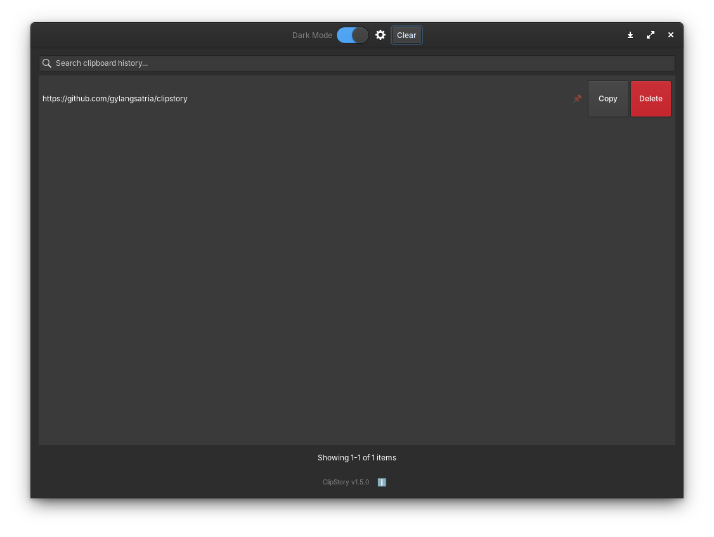
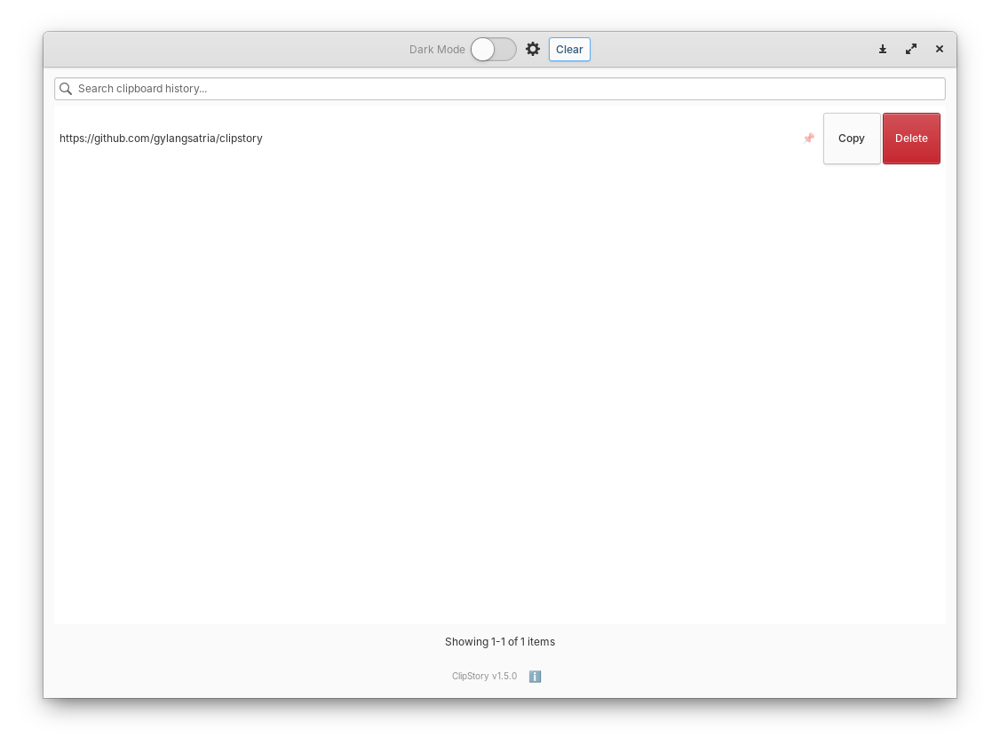

# ClipStory

[](https://appcenter.elementary.io/com.github.gylangsatria.clipboard-history)

A lightweight clipboard history manager built with GTK and Granite.
ClipStory automatically stores copied text and allows you to quickly search, reuse, and manage clipboard items.

## Features

* Automatic clipboard monitoring (X11 & Wayland)
* Searchable clipboard history
* Copy previous clipboard items with one click or double-click
* Pin important items to protect them from deletion
* Dark mode support
* Configurable history limit
* Auto-start at login option (via Portal)
* Clean and intuitive Granite interface

## Screenshots





## Installation

### AppCenter (Recommended)

Coming soon to elementary OS AppCenter!

### Flatpak

```bash
flatpak install com.github.gylangsatria.clipboard-history
```

### Build from source

#### Requirements

* GTK 3
* Granite
* Gee (collections library)
* JSON-GLib
* Vala compiler
* Meson & Ninja

Install dependencies on Ubuntu / elementary OS:

```bash
sudo apt install valac libgtk-3-dev libgranite-dev libgee-0.8-dev libjson-glib-dev meson ninja-build
```

#### Build & Install

```bash
git clone https://github.com/gylangsatria/clipstory.git
cd clipstory
meson setup build
meson compile -C build
sudo meson install -C build
```

#### Uninstall

```bash
sudo ninja -C build uninstall
```

### Quick Dev Setup (dev-setup.sh)

The project includes a helper script `dev-setup.sh` with an interactive menu for common development tasks:

```bash
./dev-setup.sh
```

Menu options:
```
========================================
  Clipboard History - Dev Tools
========================================
 1. Install packages         — Install all dev dependencies
 2. Uninstall packages       — Remove dev dependencies
 3. Check package status     — Check which packages are installed
----------------------------------------
 4. Build (meson setup)      — Configure the build directory
 5. Compile (meson compile)  — Compile the project
 6. Install (sudo ninja)     — Install to system
----------------------------------------
 7. Build .deb package       — Create a .deb package
 8. Exit
========================================
```

Typical workflow after cloning:
```bash
./dev-setup.sh    # Select: 1 → 4 → 5 → 6
```

### Build .deb Package

```bash
meson setup build
meson compile -C build
DESTDIR=$PWD/deb-package meson install -C build
dpkg-deb --build deb-package/
```

## Project Structure

```
clipstory
 ├── src
 │   ├── main.vala
 │   ├── window.vala
 │   └── clipboard-history.vala
 │
 ├── data
 │   ├── com.github.gylangsatria.clipboard-history.desktop
 │   ├── com.github.gylangsatria.clipboard-history-autostart.desktop
 │   ├── com.github.gylangsatria.clipboard-history.metainfo.xml
 │   └── icons
 │       └── hicolor
 │           └── 128x128
 │               └── apps
 │                   └── com.github.gylangsatria.clipboard-history.png
 │
 ├── assets
 │   ├── screenshot-dark.png
 │   └── screenshot-light.png
 │
 ├── com.github.gylangsatria.clipboard-history.yml
 ├── deb-package
 ├── build
 └── README.md
```

## How It Works

The application monitors the system clipboard periodically.
Whenever new text is copied, it is stored in an internal history list.

Users can:

* search the clipboard history
* copy previous entries
* remove unwanted entries
* clear the entire history

A maximum history size prevents unlimited memory usage.

## Future Improvements

Possible improvements for future versions:

* Wingpanel indicator integration
* Clipboard popup similar to Windows Win+V
* Image clipboard support
* Persistent history using SQLite
* Global keyboard shortcuts
* Pinned clipboard items [Added in 0d5c60e]

## License

GNU General Public License v3.0
